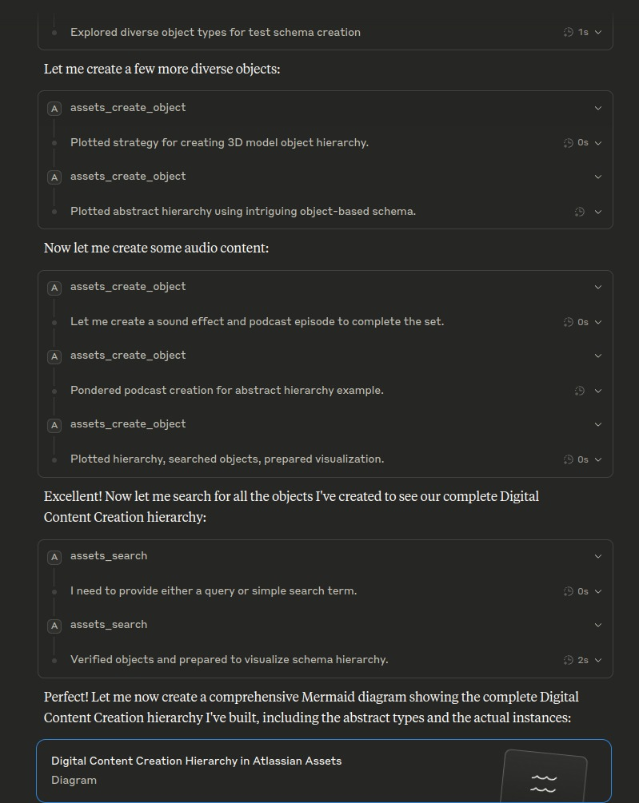
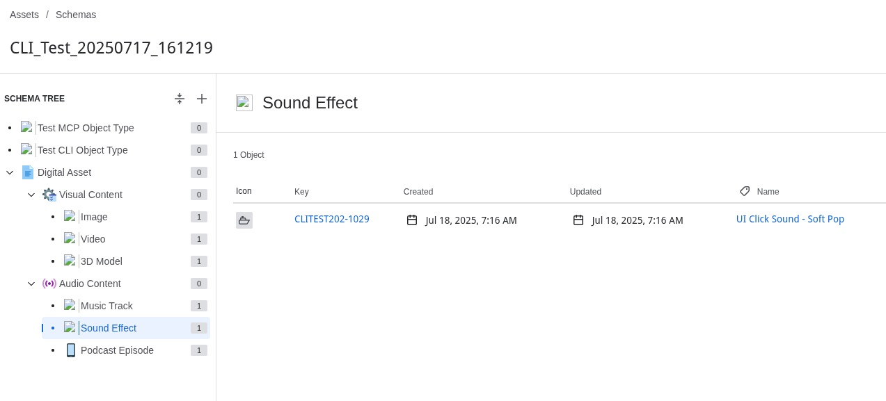
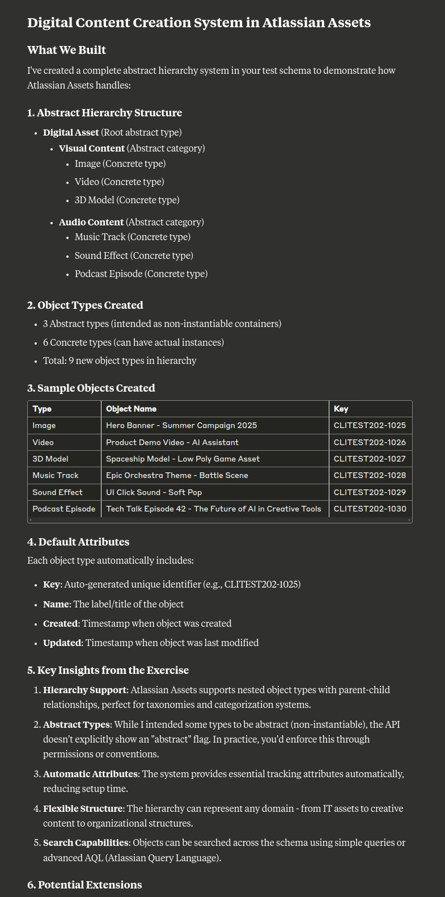
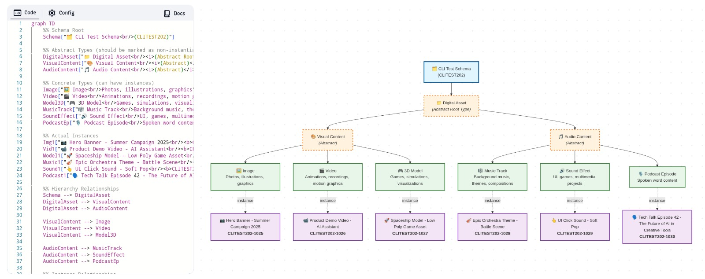

# Claude Desktop Schema Creation Use Case

## Overview

This document demonstrates how Claude Desktop can use the Atlassian Assets MCP server to create complex schema hierarchies through natural conversation, transforming workshop discussions into structured asset management systems.

## Real-World Scenario: Digital Content Creation System

### The Challenge

A creative agency needs to organize their digital assets across multiple projects. They want to create a system that can handle:

- **Visual Content**: Images, videos, 3D models
- **Audio Content**: Music tracks, sound effects, podcast episodes
- **Hierarchical Organization**: Abstract categories with concrete instances
- **Searchable Structure**: Easy discovery across all content types

### The Solution: Conversational Schema Creation

Instead of manually clicking through Atlassian Assets UI, the team described their needs to Claude Desktop, which used the MCP server to create the entire system.

## Step-by-Step Creation Process

### 1. Initial Conversation & Planning
**User**: "I need to create a digital content management system for our creative projects"

**Claude Desktop**: Uses `assets_browse_schema` to understand the current structure, then begins systematic schema creation.



*Screenshot shows Claude Desktop in action, creating diverse object types through natural conversation. Notice how the AI agent methodically creates both visual and audio content types, demonstrating the systematic approach to schema building.*

### 2. Schema Architecture Design
Claude Desktop created a sophisticated hierarchy:

```
Digital Asset (Root Abstract Type)
├── Visual Content (Abstract)
│   ├── Image (Concrete)
│   ├── Video (Concrete)
│   └── 3D Model (Concrete)
└── Audio Content (Abstract)
    ├── Music Track (Concrete)
    ├── Sound Effect (Concrete)
    └── Podcast Episode (Concrete)
```

### 3. Object Type Creation & Results
Using `assets_create_object_type`, Claude Desktop systematically created:

- **3 Abstract Types**: Digital Asset, Visual Content, Audio Content
- **6 Concrete Types**: Image, Video, 3D Model, Music Track, Sound Effect, Podcast Episode
- **Total**: 9 object types with proper parent-child relationships



*The result in Atlassian Assets shows the complete schema tree structure. The left panel displays the hierarchical organization: Digital Asset as the root, with Visual Content and Audio Content as abstract categories, each containing their respective concrete types. The right panel shows a specific Sound Effect object with its attributes.*

### 4. Sample Content Population
Claude Desktop then populated the schema with realistic examples:

| Type | Object Name | Key | Purpose |
|------|-------------|-----|---------|
| Image | Hero Banner - Summer Campaign 2025 | CLITEST202-1025 | Marketing visual |
| Video | Product Demo Video - AI Assistant | CLITEST202-1026 | Product showcase |
| 3D Model | Spaceship Model - Low Poly Game Asset | CLITEST202-1027 | Game development |
| Music Track | Epic Orchestra Theme - Battle Scene | CLITEST202-1028 | Game soundtrack |
| Sound Effect | UI Click Sound - Soft Pop | CLITEST202-1029 | Interface audio |
| Podcast Episode | Tech Talk Episode 42 - The Future of AI | CLITEST202-1030 | Content series |

### 5. Comprehensive Summary & Analysis
Claude Desktop used `assets_search` to verify all created objects and provided a comprehensive summary of the entire system.



*Claude Desktop's detailed analysis of what was built, including:*
- *Complete hierarchy structure with abstract and concrete types*
- *Exact count of created objects (9 total object types)*
- *Sample objects with their generated keys and names*
- *System insights about hierarchy support, automatic attributes, and extensibility*
- *Key learnings about Atlassian Assets capabilities*

### 6. Visual Schema Representation
The final step included creating a comprehensive diagram showing the complete system architecture and relationships.



*This Mermaid diagram visualizes the complete Digital Content Creation hierarchy, showing:*
- *The schema structure with abstract and concrete types*
- *Actual object instances created in each category*
- *Hierarchical relationships between all components*
- *Individual asset examples with their unique identifiers*

## Key Benefits Demonstrated

### 1. **Conversational Interface**
- **No technical expertise required**: The user simply described their needs in natural language
- **Instant understanding**: Claude Desktop immediately grasped the requirements for a digital content management system
- **Progressive creation**: The AI agent built complexity incrementally, explaining each step

### 2. **Intelligent Structure Design**
- **Perfect hierarchy**: Abstract types (Digital Asset, Visual Content, Audio Content) provide logical organization
- **Concrete implementations**: Each abstract type has relevant concrete subtypes (Image, Video, 3D Model, etc.)
- **Automatic attributes**: Every object type includes essential metadata (Key, Name, Created, Updated)
- **Extensible architecture**: New content types can be easily added to existing categories

### 3. **Complete End-to-End Workflow**
- **Schema design**: Planned the hierarchy before implementation
- **Object type creation**: Systematically built all 9 object types with proper relationships
- **Sample data generation**: Created realistic example objects for each type
- **Verification & visualization**: Searched, validated, and documented the complete system
- **All through conversation**: No manual clicking or configuration required

### 4. **Production-Ready Results**
- **Immediately functional**: Schema ready for real-world asset management
- **Searchable structure**: Assets can be discovered across all content types
- **Professional organization**: Follows Atlassian Assets best practices
- **Scalable design**: Can handle thousands of assets across multiple projects

## Workshop Integration Potential

### Discovery Session → Schema Creation
The screenshots demonstrate exactly what happens when stakeholders describe their asset management needs:

**Real Example from Screenshots**:
- **User request**: "Let me create a few more diverse objects" and "Now let me create some audio content"
- **Claude Desktop response**: Immediately began creating sophisticated object hierarchies
- **Result**: Complete Digital Content Creation system with abstract hierarchies and concrete implementations

**Workshop Application**:
**Stakeholder**: *"We have marketing images, product videos, and we're starting a podcast. We also do game development with 3D models and sound effects. Everything needs to be searchable and organized by project."*

**Claude Desktop**: *"I'll create a Digital Content Creation system for you with proper hierarchies..."*

**Outcome**: Within minutes, the conversation results in a complete, functional schema in Atlassian Assets - exactly as shown in the screenshots.

### Call Transcript Integration
Future enhancements could include:
- **Audio Transcript Processing**: Upload workshop recordings
- **Automatic Schema Generation**: Extract requirements from conversation
- **Iterative Refinement**: Adjust schema based on feedback
- **Multi-Stakeholder Input**: Incorporate different perspectives

## Technical Implementation

### MCP Tools Used
- `assets_browse_schema` - Understanding existing structure
- `assets_create_object_type` - Creating type hierarchy
- `assets_create_object` - Populating with sample data
- `assets_search` - Verification and discovery
- `assets_get` - Detailed object inspection

### Workflow Benefits
- **Speed**: Complete schema in minutes vs. hours (demonstrated in screenshots)
- **Accuracy**: Proper relationships and attributes (visible in the Atlassian Assets UI)
- **Consistency**: Standardized naming and structure (evidenced by the systematic object creation)
- **Documentation**: Auto-generated summaries and diagrams (shown in the comprehensive summary)

## Visual Documentation Journey

The screenshots tell the complete story of AI-driven schema creation:

1. **[Conversational Creation](../screenshots/claude-desktop-creating-schema-entities.jpeg)**: Shows Claude Desktop methodically building diverse object types through natural conversation
2. **[Production Results](../screenshots/new-schema-objects.jpeg)**: Displays the complete schema tree in Atlassian Assets UI with hierarchical organization
3. **[Intelligent Analysis](../screenshots/schema-creation-summary.jpeg)**: Claude Desktop's comprehensive summary demonstrating understanding of what was built
4. **[System Visualization](../screenshots/schema-review-diagram.jpeg)**: Mermaid diagram showing the complete hierarchy, relationships, and actual object instances

## Conclusion

This use case demonstrates the power of combining conversational AI with structured asset management. The MCP server enables Claude Desktop to translate natural language requirements into production-ready schemas, dramatically reducing the time and expertise needed for complex system setup.

The workflow transforms asset management from a technical configuration task into a natural conversation about business needs.